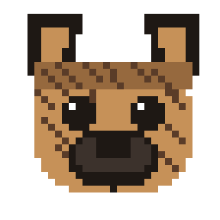

# weenus



Personal library of Claude Skills, shared across two accounts (personal +
work) and their surfaces — Claude Code on both machines, the Claude app on
web/desktop/iOS. Git is the source of truth; see
[`SKILLS-ARCHITECTURE.md`](SKILLS-ARCHITECTURE.md) for the full design
rationale and tradeoffs, and [`weenus/SKILL.md`](weenus/SKILL.md) for the
day-to-day "how do I create/update/audit a skill" workflow (that file is
itself a skill — invoke it in Claude Code by asking to create, edit, or
audit a skill in this repo).

## Skills in this repo

| Skill | Purpose |
|---|---|
| [`hotdog`](hotdog/SKILL.md) | Test skill — confirms custom skill loading works on a given surface |
| [`weenus`](weenus/SKILL.md) | Meta-skill — manages this repo's skills (create/update/audit) |

## Quickstart

### Claude Code (personal + work machines)

```bash
git clone git@github.com:jenter/weenus.git
cd weenus
./install.sh
```

Symlinks every `<skill-name>/SKILL.md` into `~/.claude/skills/<name>`.
Follows a `git pull` automatically — only re-run `install.sh` when a new
skill directory is added.

### Claude app (personal + work accounts, mobile inherits automatically)

Skills don't sync from git into the app — each account's upload is manual:

```bash
zip -r <skill-name>.zip <skill-name>
```

Then claude.ai (or desktop app) → Settings → Customize/Capabilities →
Skills → upload the zip, once per account. Full steps, including the
work-account gotcha (Skills greyed out under Enterprise) and re-upload
flow for edits, are in SKILLS-ARCHITECTURE.md's rollout runbook.

## Adding a new skill

```bash
./new-skill.sh <skill-name>
```

Scaffolds `<skill-name>/SKILL.md` with correct frontmatter (only `name`,
`description`, `license`, `compatibility`, `metadata`, `allowed-tools` are
accepted by the uploader/API/packager — anything else fails packaging).
Fill in the body, then follow the Quickstart above to roll it out.

## Content boundary

This repo is public-adjacent infrastructure (private repo, but leaves your
control the moment it's on GitHub). Generic engineering skills belong
here. Anything with client specifics, internal endpoints, or company
process detail stays in company git instead, reachable only from work
Claude Code — see the open items in SKILLS-ARCHITECTURE.md.
